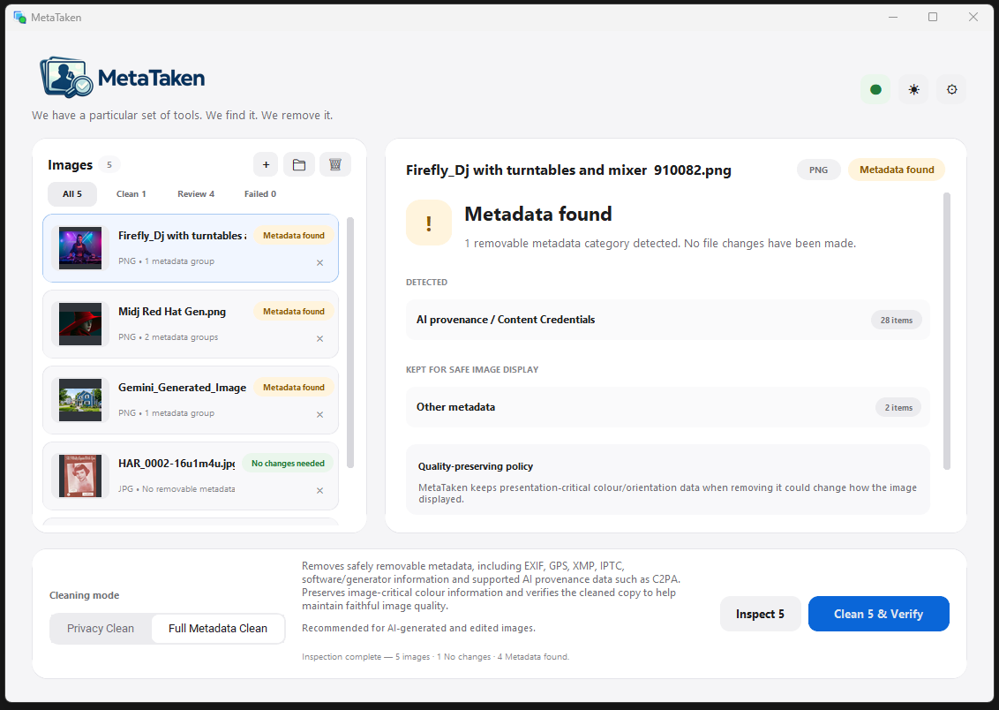

  <picture>
    <source media="(prefers-color-scheme: dark)" srcset="assets/metataken-wordmark-dark.png">
    <source media="(prefers-color-scheme: light)" srcset="assets/metataken-wordmark-light.png">
    
  </picture>

<strong>We have a particular set of tools. We find it. We remove it.</strong>

<strong>Inspect. Clean. Verify.</strong>

  A free, local Windows utility for seeing what information is attached to an image, 
  removing supported metadata from a separate cleaned copy, and verifying the result. 
  <strong>Your original stays untouched.</strong>

  <strong>No uploads. No account. No application telemetry.</strong>

  <a href="https://github.com/Tezshouse-TeXne/MetaTaken/releases/tag/v0.3.0-rc2"><strong>View MetaTaken v0.3.0-rc2</strong></a>
  ·
  <a href="https://github.com/Tezshouse-TeXne/MetaTaken/releases/download/v0.3.0-rc2/MetaTaken-v0.3.0-rc2-portable.zip"><strong>Download Windows portable ZIP</strong></a>
  ·
  <a href="https://metataken.com/"><strong>metataken.com</strong></a>

---

## Your photo can say more than you think.

Images can carry information you never see in the picture itself — where they were taken, when they were taken, what device was used, who created or edited them, and which software or AI tools were involved.

MetaTaken puts that information into understandable categories, lets you choose how much to remove, creates a **separate cleaned copy**, and then automatically inspects that copy again.

**Your original is never cleaned in place or silently overwritten.**

## Why would I use MetaTaken?

You do not need to know what EXIF, XMP or C2PA means to have a reason to care about image metadata.

- **Selling something online** — photos taken at home can carry location, date and device details that you may not want attached to a public listing.
- **Posting on social media** — check for location, timestamps, device information, creator details and editing history before you hit Post.
- **Sharing personal photos** — share the picture without unnecessarily sharing where it was taken, what device you used, account details or editing history.
- **Sharing AI-created or AI-edited images** — Full Metadata Clean can remove supported Content Credentials, C2PA/JUMBF provenance and generator metadata. Where a platform applies an “AI content” label from those embedded signals, removing them can prevent that metadata-based label from following the cleaned file. Platforms may also use independent detection methods.

## Drop → Inspect → Clean → Verify

The main workflow is deliberately small:

1. **Drop** — add individual images, folders, subfolders or batches.
2. **Inspect** — see what MetaTaken can identify in plain language, with raw technical detail available when you want it.
3. **Clean a copy** — choose Privacy Clean or Full Metadata Clean. MetaTaken creates a new output file and leaves the source untouched.
4. **Verify** — the cleaned copy is inspected again, with decoded-pixel comparison where supported.

  <picture>
    <source media="(prefers-color-scheme: dark)" srcset="assets/metataken-app-dark.png">
    <source media="(prefers-color-scheme: light)" srcset="assets/metataken-app-light.png">
    
  </picture>

## Choose how far to go

### Inspect Only

See what MetaTaken can identify without modifying the file.

### Privacy Clean

Remove personal and private metadata from a separate cleaned copy, including supported location/GPS data, author/account details, device information and timestamps.

### Full Metadata Clean

Remove all safely removable metadata MetaTaken supports, including supported C2PA / Content Credentials / JUMBF provenance, generator information and other embedded metadata.

### What about the date the photo was taken?

Privacy Clean targets timestamps, and Full Metadata Clean removes supported metadata more broadly. That can include the original capture date where it is stored as removable metadata.

The important distinction is that **the cleaned copy may lose that metadata, but your untouched original keeps it**.

## Verification is part of the operation

MetaTaken does not treat a successful cleaning command as proof that the job is finished.

After cleaning, the output is inspected again and MetaTaken reports what was:

- detected
- removed
- retained
- unsupported
- uncertain
- not tested

Where practical, MetaTaken also compares decoded image content before and after cleaning. It reports **Pixel content unchanged** only when that check actually passes.

If something remains, is uncertain, is structurally protected or cannot be safely verified, MetaTaken can return **Review** rather than pretending the file is completely clean.

## What MetaTaken looks for

Under the plain-language categories, MetaTaken can inspect and, where safely supported, remove metadata such as:

- EXIF and camera/device information
- GPS and location data
- XMP and IPTC metadata
- author and account information
- comments and descriptions
- timestamps
- software and generator information
- embedded thumbnails and previews
- C2PA / Content Credentials / JUMBF provenance data
- other removable metadata identified by ExifTool and MetaTaken's format-aware checks

Raw technical metadata is available through the Advanced view.

## Supported image formats

Current inspection and cleaning support:

- JPEG / JPG
- PNG / APNG
- WebP / Animated WebP
- GIF
- HEIC / HEIF / HIF*

\* HEIC/HEIF/HIF decoded-pixel verification depends on compatible Windows WIC/codec support for the specific file.

Additional formats may be added only where they can be supported and verified reliably.

## Privacy by design

MetaTaken is deliberately local-first:

- image processing stays on your computer
- no account is required
- no cloud image-processing path
- no application telemetry
- local preferences only
- ExifTool is bundled locally

## Metadata is not the same as a watermark

MetaTaken cleans supported metadata and provenance structures. It does not claim to remove pixel-level watermarks.

### SynthID

SynthID is pixel-level watermarking rather than conventional metadata.

MetaTaken does **not** attempt to remove SynthID. Unless a sufficiently reliable detector is available and actually used, MetaTaken reports:

**SynthID: Not tested / detection unavailable**

That status is not evidence that SynthID is absent.

## Current release — v0.3.0-rc2

MetaTaken v0.3.0-rc2 is an accepted release candidate for v0.3.0.

RC2 has passed retained regression testing, packaged Windows validation, parallel-processing comparison testing and the full 187-image reference corpus.

The portable build requires no installer: extract the ZIP and run `MetaTaken.exe`.

**Release page:**  
https://github.com/Tezshouse-TeXne/MetaTaken/releases/tag/v0.3.0-rc2

**Direct download:**  
https://github.com/Tezshouse-TeXne/MetaTaken/releases/download/v0.3.0-rc2/MetaTaken-v0.3.0-rc2-portable.zip

The release page is the public authority for current release notes, checksum information and known limitations.

## About this repository

This repository is MetaTaken's public GitHub home. It currently hosts the public website source and official release downloads.

The website is intentionally lightweight: static HTML/CSS, no analytics, no cookies, no external fonts and no third-party JavaScript. Open `index.html` directly to preview it locally.

## Built on trusted tooling

ExifTool is MetaTaken's primary metadata engine. Third-party components and required attribution are documented with the distributed application and project material.

## MetaTaken by Tezshouse TeXne

MetaTaken™ is developed and published by **Tezshouse TeXne**.

**MetaTaken:** https://metataken.com/  
**Tezshouse TeXne:** https://tezshousetexne.com/  
**GitHub:** https://github.com/Tezshouse-TeXne/MetaTaken

Copyright © 2026 Tezshouse TeXne. All rights reserved.
